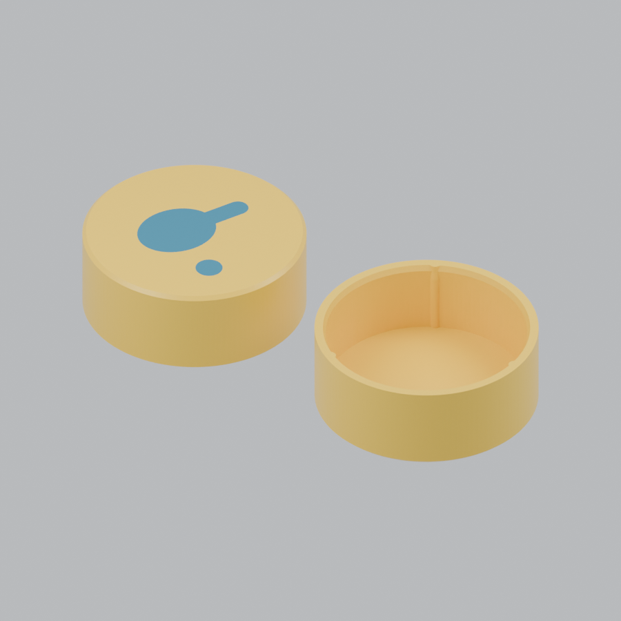

# PongFetch — final decorative handle-end cap

The user selected the tightest equal-wall A3 sample on **2026-09-22**: cylindrical **ID 21.44 mm, OD 23.84 mm, wall 1.20 mm**. This final version preserves that fit and restores the flush two-colour paddle-and-ball logo. Earlier trial variants are retired from the active delivery; their history remains in Git. The D hanger is unchanged.

## Dimensions and logo

| Feature | Selected value |
|---|---:|
| Target actual PVC OD | 21.34 mm |
| Cylindrical bore / outside diameter | 21.44 / 23.84 mm |
| Straight wall / closed face | 1.20 / 1.20 mm |
| Overall height / insertion depth | 9.20 / 8.00 mm |
| Three rounded rib contact diameter | 20.94 mm |
| Flush logo depth | 0.40 mm |

The assembled cap extends about 1.2 mm beyond the seated pipe end. The logo is on the outside closed face and adds no height. It occupies the first two 0.20 mm print layers, with 0.80 mm of body material behind it. Use two colours of PETG; the saved example is yellow with a dark-blue mark. The logo is co-printed, not a separate press-fit insert.

## Print

Open **`PongFetch_EndCap_Logo_X2D_PETG_Basic.3mf`**. It contains one assembled object with two correctly aligned parts: cap body and logo. Assign the actual PETG spools/nozzle mapping and re-slice. Print with the logo face on the bed and opening upward.

Saved settings: X2D, 0.4 mm nozzle, textured PEI, Bambu PETG Basic, 0.20 mm first and subsequent layers, four requested walls, 20% gyroid, no supports or brim. Thin sections contain only the wall lines that fit. The delivered project contains no G-code. The saved slice estimates **1.64 g and 18 minutes**; actual start-up, purge and material use can differ.

- `EndCap_body.stl` + `EndCap_logo.stl`: alternate multipart import; import together as parts of **one object**, preserve shared coordinates and assign colours. The logo mesh intentionally contains two pieces, paddle and ball.
- `EndCap_plain.stl`: complete single-colour fallback without a visible logo; byte-identical to the user-selected equal-wall A3 ID21.44 sample.
- `source/EndCap.scad`: standalone editable OpenSCAD source. Default `part="assembly"` previews both colours; export `body` and `inlay` for the logo version, or `cap` for the plain version. The final fit is the default; there is no trial-grade selector.

The user has approved the plain cap's fit. The logo version has been checked digitally for alignment, closed geometry, the same complete envelope and native support-free slicing; it has not yet been physically printed. This is a decorative cap, not a hanging attachment. Use the D hanger for suspension.

## 中文

最终采用你选中的最紧版本：ID 21.44 mm、OD 23.84 mm、壁厚 1.20 mm。内壁、凸筋和安装尺寸保持原样，补回齐平的双色的球拍＋乒乓球 Logo，不增加高度。

请使用双色 3MF，确认实际 PETG 颜色和喷嘴/料卷映射后重新切片。Logo 面贴床、开口向上。两个 STL 若手动导入，需要作为同一个对象的两个部件导入，不能分别居中或单独打印 Logo。单色备用 STL 与已通过试用的样品完全相同。

## License

Original design: PongFetch / Tia-Lin, **CC BY-NC-SA 4.0**. Official legal text is included in the download bundle and repository root. Bambu Studio/profile content retains its own terms. Geometry and slice checks are recorded in `verification/`.
