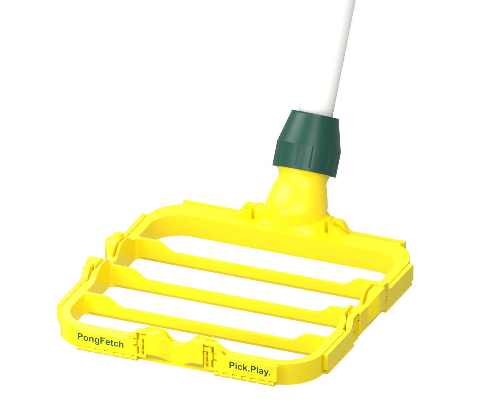
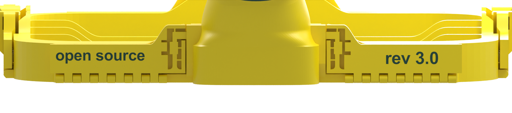

# PongFetch · rev 3.0

**Pick.Play.** A 3D-printable table-tennis ball picker with a removable PVC handle.

Press the frame over 40 mm balls. Three flexible fins let the balls pass into a mesh net; eight folding latches secure the net. A six-finger collet and screw cap hold the handle without glue, so it can be reused.



**[Download rev 3.0](https://github.com/Tia-Lin/PongFetch/releases/tag/v3.0)** · [Printing](prints/PRINTING.md) · [Assembly](docs/ASSEMBLY.md) · [Accessories](Accessories/README.md) · [License](LICENSE.md)

## Make one

Print one frame, one collet and one cap. Add a fine mesh net and a PVC pipe matching the design's **21.34 mm outside diameter**. Measure the actual pipe before printing; the size printed on plumbing pipe is not its outside diameter. Net pins are 2.8 mm in diameter, so check that your mesh can pass over them.

| File | Use |
| --- | --- |
| [Frame 3MF](prints/PongFetch_Rev3_Frame.3mf) | Frame, eight folding latches, flush two-colour lettering and local bridge modifiers |
| [Handle parts 3MF](prints/PongFetch_Rev3_Handle_Parts.3mf) | One collet and one cap, in their saved print orientations |
| [Frame STL](SmallPicker.stl) | Single-colour frame; no visible flush lettering |
| [Collet STL](Collet.stl) · [Cap STL](ColletCap.stl) | Single-part meshes for your own slicer setup |

The release includes individual print files, an editable-design ZIP, a complete **Maker Bundle**, and SHA-256 checksums. GitHub's automatic source archive contains the repository; the Maker Bundle is the curated printing download.

The validated mechanical parts were printed in PETG. Review the saved **4 walls and 0.20 mm layers / first layer**. **Select your actual printer, plate and loaded materials, then re-slice both 3MF projects.** The files save different machine profiles; they are not ready-to-send G-code. See [the exact saved settings](prints/PRINTING.md).

After cooling, release the three thin first-layer ties at each latch. Place the net between the flap and frame, engage the pins through the mesh, and keep the net clear of the release spring. Seat the collet's locating skirt and hand-tighten the cap. No glue is needed.

## Accessories

Two optional attachments for the free end of the same PVC handle are now included in the Maker Bundle and in the separate [Accessories download](https://github.com/Tia-Lin/PongFetch/releases/download/v3.0/PongFetch_Accessories.zip).

| Accessory | Print project | Details |
| --- | --- | --- |
| Decorative end cap | [Two-colour end cap](Accessories/EndCap/PongFetch_EndCap_Logo_X2D_PETG_Basic.3mf) | User-selected ID 21.44 mm, OD 23.84 mm, 1.20 mm wall; flush paddle-and-ball logo |
| Removable hanger (D) | [Hanger and compression nut](Accessories/Hanger/PongFetch_Hanger_X2D_PETG_Basic.3mf) | Two printed parts; clamps to the pipe without glue or drilling |

Both accessory projects save X2D / 0.4 mm / PETG Basic / textured PEI / 0.20 mm layers / 4 walls, with supports disabled. Re-slice for the actual printer and loaded materials. The user has approved the end-cap fit and reported the hanger works well; long-term load capacity is not rated. See [Accessories](Accessories/README.md) for assembly and validation scope.

The 2026-09-22 accessory supplement leaves the core rev 3.0 geometry and published core print files unchanged. The `v3.0` tag still identifies the original core release; updated download bundles record their source commit in `PACKAGE_INFO.json`.

## What is validated?

The current frame, skirted collet and cap have been physically printed and reported stable and usable by the designer. Rev 3.0 adds four flush labels: `PongFetch`, `Pick.Play.`, `open source`, and `rev 3.0`. Their orientation is defined for the **closed, assembled flaps**.




The 0.60 mm text inlay and material partition were checked digitally. The coloured finish and long-term durability have not been established by those checks. This publication preserves the current CAD, STL and 3MF files; it adds no untested mechanical revisions. See [validation scope](docs/VALIDATION.md).

## Edit the design

Install [OpenSCAD](https://openscad.org/) and [BOSL2](https://github.com/BelfrySCAD/BOSL2) separately. Put BOSL2 in OpenSCAD's library search path. Open `SmallPicker.scad` with the other three SCAD files beside it.

| Source | Contents |
| --- | --- |
| `SmallPicker.scad` | Frame, flat-bottom fins, latch placement and part selection |
| `SideLatch.scad` | Side-release latches, net pins and first-layer ties |
| `ColletSocket.scad` | Socket, locating-skirt collet and screw cap |
| `Branding.scad` | Text, assembled orientation and inlay depth |

Choose `part` in the Customizer: `frame`, `cap`, `collet`, `assembly`, or `exploded`. For two colours, export `frame_base` and `frame_text`, then import them **as parts of one object at their shared coordinates**, without separately centering them. `Arial:style=Bold` is used for the text; use a licensed local font or change `brand_font` and recheck text fit. No font or BOSL2 files are bundled.

With Python 3 and OpenSCAD on your PATH:

```sh
python3 scripts/export_parts.py --parts cap collet
python3 scripts/verify_release.py
```

Omit `--parts` to also export the frame; that can take several minutes. Use `--openscad /path/to/openscad` if needed. The existing export baseline used OpenSCAD 2021.01; the exact installed BOSL2 revision was not recorded, so recheck exports after changing dependencies.

## Repository and contributions

This repository contains the product design, print files, documentation and compact verification reports. The product website is maintained separately; its application code is no longer part of this repository. Design downloads and releases remain available here. Slicer logs and old prototypes are excluded from the published tree.

For a bug report or improvement, [open an issue](https://github.com/Tia-Lin/PongFetch/issues) with the revision, printer, nozzle, material, layer height, wall count and a photo. For a design change, include editable source and describe what you tested. Keep print orientation, support-free printing and net routing in mind.

## License

The original design materials are **CC BY-NC-SA 4.0**: noncommercial copying, printing and adaptation are permitted under the license; shared work must retain attribution, identify changes and comply with ShareAlike. Commercial use requires separate permission where licensed rights are involved. Sharing editable source with a remix is encouraged, not an extra license requirement.

Read [LICENSE.md](LICENSE.md) for scope and attribution, the unmodified [official legal text](CC-BY-NC-SA-4.0.txt), and [third-party notices](THIRD_PARTY_NOTICES.md). Website application code and Python utilities remain outside the design-license grant.

Because commercial reuse is restricted, this is a **source-available design for noncommercial use**, not an OSI open-source project. The historical `open source` label on the model does not change the license.

## 中文快速说明

本套件为 rev 3.0：框身（含八只翻片）、压紧夹头、锁紧螺帽各一件。另需网袋和外径约 21.34 mm 的 PVC 管；先量实际管径。优先下载 Release 的 Maker Bundle，双色文字使用框身 3MF，单色 STL 不显示齐平嵌字。

保留已经验证的机械结构及最新打印项目。打开 3MF 后选择自己的打印机、材料和打印板并重新切片；两张打印盘保存的机器配置不同。释放每只翻片的三条首层细筋，再装网、安装可拆把手。详见[打印说明](prints/PRINTING.md)和[装配说明](docs/ASSEMBLY.md)。

可选 [Accessories 配件](Accessories/README.md) 已并入完整下载包：最终双色装饰帽，以及可拆卸 D 挂钩和旋紧环。已有主体可以单独下载 Accessories 包。

采用 **CC BY-NC-SA 4.0（署名—非商业性使用—相同方式共享）**，具体范围以 LICENSE.md 及官方许可原文为准。
