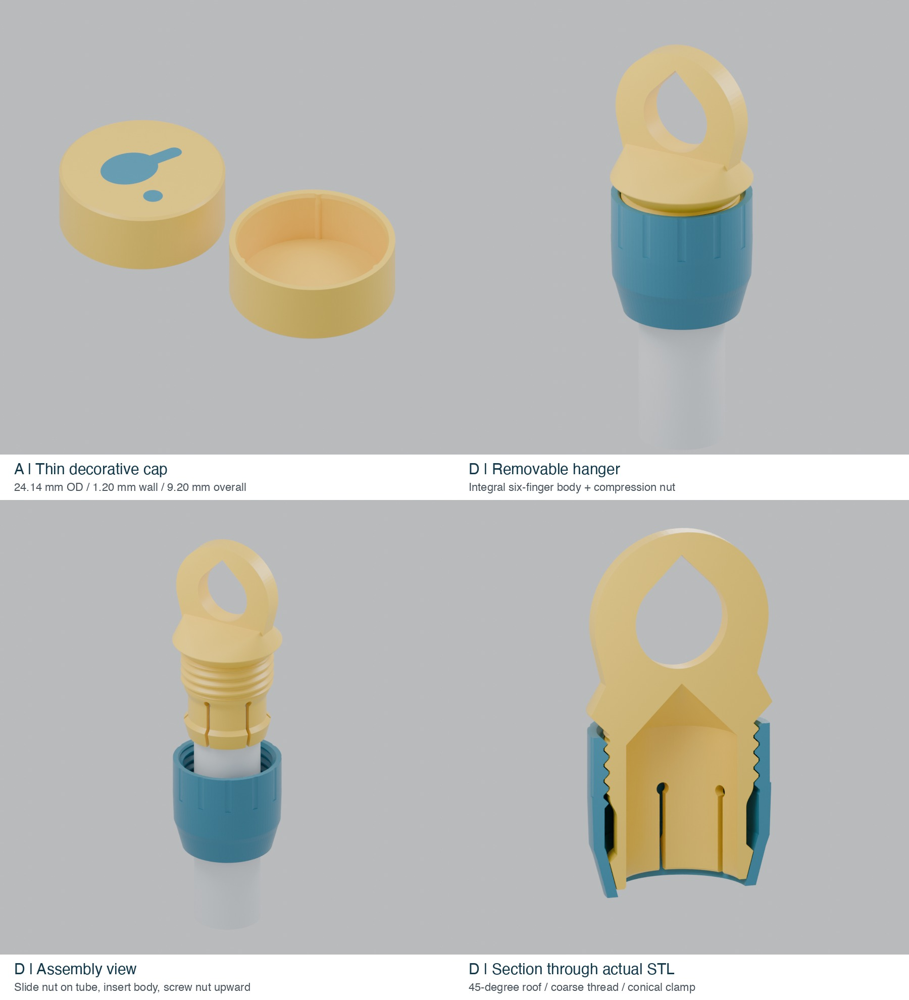

# PongFetch handle tops — prototype 1

**User feedback, 2026-09-20:** D works very well in the user's trial; A1 fits loosely. See [A2 same-height fit trials](../end-cap-a2/README.md) for the next A iteration. D geometry is unchanged. This feedback is not a quantified load or endurance test.

Two interchangeable accessories for the **free end** of a PVC handle. These are separate prototypes; the tested rev3.0 picker, socket, collet and cap are unchanged. Target PVC outside diameter: **21.34 mm**. Neither accessory uses the pipe's inside diameter as a fit reference.

## A — thin decorative cap

| Feature | Dimension |
|---|---:|
| Outside diameter | 24.14 mm |
| Overall height / tube insertion | 9.20 / 8.00 mm |
| Wall / closed face | 1.20 / 1.20 mm |
| Main bore | 21.74 mm |
| Three rounded rib contact diameter | 21.24 mm |
| Flush paddle-and-ball inlay | 0.40 mm deep |

Only the 1.2 mm closed face projects beyond the fully seated pipe end. Three rounded ribs give light retention, with a tapered entrance. The nominal rib-tip diameter is 0.10 mm smaller than the nominal pipe diameter; this is a trial fit, not a guaranteed printed interference. This cap is **decorative, not a hanging attachment**.

Print `A_fit_ring.stl` first (about 0.5 g of solid PETG). This 4.8 mm ring preserves the real opening taper, but its shorter contact length cannot predict full-cap removal force. If tight, increase `contact_d` in 0.10 mm steps; if loose, decrease it. Do not force an undersized ring onto the pipe.

- `A_Prototype_X2D_PETG_Basic.3mf`: native Bambu project with body and flush inlay grouped, two PETG colours. Re-slice after selecting the actual spools/nozzle mapping.
- `A_plain.stl`: complete one-colour cap with no visible logo.
- `A_body.stl` + `A_inlay.stl`: alternative multipart import; import together, preserve relative coordinates and assign colours. Do not print the inlay separately or independently centre the parts.
- `source/EndCapA.scad`: editable geometry, no external library required.

Print with the closed exterior/logo face on the bed and opening upward. The logo occupies the first two 0.20 mm layers. Estimated slice: **18 min, 1.67 g** with the saved X2D profile; actual start-up, colour-change and purge use may differ.

## D — removable hanging eye with integral clamp

Two parts: `D_body.stl` integrates the eye, male thread and six flexible fingers; `D_nut.stl` provides the female thread and compression cone. The render uses two colours to identify the parts; the supplied D project prints both in one colour.

| Feature | Dimension |
|---|---:|
| Unclamped bore | 21.74 mm (0.40 mm diametral clearance) |
| Straight finger wall / slots | 1.73 / 1.20 mm |
| Rounded slot-root relief | Ø2.40 mm |
| Compression cone | 15° to the axis |
| Male thread major diameter / pitch | 30.0 / 3.0 mm |
| Thread depth / diametral clearance | 1.0 / 0.60 mm |
| Body maximum diameter / height | 35.40 / 67.20 mm |
| Nut maximum diameter / height | 35.00 / 30.80 mm |
| Eye plate thickness / outer width | 6.40 / 34.00 mm |
| Eye aperture maximum width | 18.00 mm, pointed roof |
| Projection above nominal seated pipe end | About 39.5 mm |

The ring advances toward the eye when tightened. Its cone presses the fingers inward against the pipe. Loads pass from the hanging eye through the broad shoulder and integral body to friction at the pipe. Rounded slot roots and a gradual transition into the threaded section reduce abrupt section changes. The eye has a pointed, 45° roof to avoid a broad horizontal bridge. The pipe socket also has a 45° internal roof rather than a flat bridging ceiling.

The widened finger tips are about Ø27.99 mm and can pass through the female thread's nominal Ø28.60 mm minimum opening. This clearance was checked explicitly. The thread entry stays clear throughout the designed stroke.

`travel=0` in the source is an assembly reference position, **not the start of thread engagement**. From that position, cone contact begins at roughly 0.67 mm advance, and matching shoulder cones meet at approximately 2.0 mm. That leaves nominal room to take up the 0.20 mm radial pipe clearance and apply some preload. Actual force depends on the printed fingers and pipe. The shoulder is a travel stop, **not a torque limiter**; stop tightening once the pipe is held firmly, even if the shoulder has not seated.

### Assembly and trial

1. Slide the nut onto the free pipe end, with its large threaded opening toward that end.
2. Slip the body onto the pipe until seated against the internal roof.
3. Bring the nut up to the male thread, engage gently and hand-tighten toward the eye. Check that the body cannot readily rotate or pull off. Do not use pliers to force the shoulder closed.
4. To remove, loosen the nut until the fingers relax, then lift off the body.

First check thread engagement without the pipe, then check fit on the actual pipe. Mark the pipe at the body edge and test the empty picker close to a padded surface. Recheck for slip, rotation or cracks after repeated removal and a 24-hour hanging trial with the intended storage load. Do not treat this prototype as load-rated: PETG creep, layer adhesion and friction have not been physically measured. If the shoulder closes while the pipe still slips, revise the fit rather than applying more torque.

### Printing D

Use `D_Prototype_X2D_PETG_Basic.3mf`, or import the two STLs in their supplied orientations. Body: six finger tips on the bed, eye upright. Nut: smaller end down. The project adds a **2 mm external brim only to the body**, with 0.15 mm separation, to help its six separate starting feet; this is slicer-generated, not permanent breakaway ears in the CAD.

Both projects use X2D, 0.4 mm nozzle, textured PEI, Bambu PETG Basic, **0.20 mm first layer and subsequent layers, 4 walls, 20% gyroid, support disabled**. Narrow sections contain as many wall lines as fit; setting four walls does not thicken the 1.2 mm A shell. The D two-part slice estimates **1 h 45 min and 23.30 g**, including the saved brim/toolpath settings.

The upright body orientation prioritizes printable threads and fingers. It leaves layer interfaces across the hanging load direction; the wide eye and shoulder help distribute load, but do not eliminate that weakness. Do not assume slicing success proves long-term strength.

## Verification performed

- OpenSCAD 2021.01 exports; BOSL2 2.0.716 for D's thread generation.
- All six delivered STL files have closed, consistently oriented meshes; D body and nut are each one solid. The A inlay intentionally contains two solids (paddle and ball).
- Rigid geometry sweep through the nominal 0–2 mm tightening stroke: no unintended upper-body/thread interference. Cone/finger overlap after initial contact represents intended elastic movement; no deformation or stress simulation was performed. At 2.1 mm the shoulder interferes as expected.
- Layer-section screening at 0.20 mm spacing found no broad unsupported shelves. The rounded slot roots have short local roof spans up to 2.4 mm; these remain real bridging/overhang features and should be inspected on the first print.
- Native Bambu Studio 02.08.03.66 slicing completed for A and D, with `support_used=false` and `outside=false`. This confirms toolpath generation, not physical print success.
- Re-imported native 3MF part coordinates preserve the original meshes, including A's flush inlay alignment. Delivered 3MFs are editable projects with G-code removed; re-slice before printing.
- Detailed geometry and slice records are in `verification/`.

## Source use

For A select `part="cap"`, `"body"`, `"inlay"` or `"fit_ring"` in `source/EndCapA.scad`.

For D install BOSL2 in the OpenSCAD library path and select `part="body"`, `"nut"`, `"assembly"`, `"exploded"` or `"section"` in `source/HangerD.scad`. Only `body` and `nut` exports are print orientations. Assembly and section views are for inspection. In assembly coordinates the nut rotates `360*travel/3` degrees while moving `travel` mm upward.

## 中文试打要点

A 是轻薄装饰帽，先用小试配环检查 PVC 管松紧；双色图案与表面齐平。D 是两件式可拆挂环，先把螺帽套到管上，再套入本体，最后手拧螺帽夹紧。D 图中不同颜色只用于说明结构，打印项目默认单色。

两个项目都按 0.20 mm 层高、4 圈墙、PETG Basic、无支撑准备。D 本体六瓣朝下，增加了 2 mm 切片 brim 帮助首层附着。实际夹紧力、长期滑脱和耐久性还没有实测；先试装、做拔出/扭转检查，再进行低位悬挂观察。原 rev3.0 主体及锁紧件没有修改。

## License

Original accessory designs: PongFetch / Tia-Lin, **CC BY-NC-SA 4.0**; see the included official `CC-BY-NC-SA-4.0.txt`. Based on the PongFetch project at https://github.com/Tia-Lin/PongFetch. BOSL2 is a separately installed BSD-2-Clause dependency and is not included. Bambu Studio and its profile content retain their own terms; the design license does not relicense those components.
